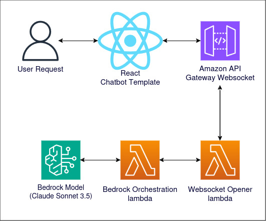

# Bedrock Streaming Response

## Table of Contents
- [What it does](#what-it-does)
- [How we can use it at the CIC](#how-we-can-use-it-at-the-cic)
  - [Request Pipeline Comparison](#request-pipeline-comparison)
  - [Use Cases](#use-cases)
- [Demo Deployment Instructions](#demo-deployment-instructions)
  - [Prerequisites](#prerequisites)
  - [Repository Setup](#repository-setup)
    - [Initial Setup](#initial-setup)
  - [Backend Setup](#backend-setup)
    - [AWS Configuration](#aws-configuration)
    - [Backend Environment Setup](#backend-environment-setup)
    - [AWS CDK Deployment](#aws-cdk-deployment)
  - [Frontend Setup](#frontend-setup)
    - [Configure Frontend Settings](#configure-frontend-settings)
    - [Build the Frontend](#build-the-frontend)
    - [Prepare for Deployment](#prepare-for-deployment)
    - [Deploy to AWS Amplify](#deploy-to-aws-amplify)

## What it does

The Response Streaming setup for bedrock is the same pipeline as the standard Bedrock invocation process, with one major difference. Rather than returning the full text in a single request, it returns each token as they're outputted. This allows for quicker response times, and more interesting frontend UIs.

The specific demo uses a React hosted frontend utilizing the Chatbot Template (https://github.com/ASUCICREPO/ChatbotTemplate), this invokes the backend through an Api Gateway Websocket, rather than the standard REST api gateway. Through this the request is routed to a lambda function, the "connection opener" lambda. The purpose of this lambda is to allow the initial opening of the websocket connection, and to call the main function. (TODO: I believe this can be done with step functions to simplify to one lambda) Next the main lambda function will call bedrock through the converse stream API, for each token returned, it will be sent back to the api gateway to the frontend.



## How we can use it at the CIC

The main way that we can use it at the CIC is to improve the Time to First Token. For most LLM pipelines the process looks like:

### Request Pipeline Comparison

Request->Processing->Generation->Response in Full

By streaming the response we can fully get rid of  the Generation step, since the first response is received as soon as the first token is generated.

Request->Processing->Response of First Token

### Use Cases

This is especially useful for projects that require more complex thought (Longer responses). The longer the average response length, the more time implementing streaming can save. This saved time can be used to do additional pre-processing (RAG, more complex thought time, etc), or use a slower but more intelligent model, such as Haiku -> Sonnet/Opus. The other major use for streaming the response is to create more interesting frontend UI's, since you receive each token, you can create a cursor effect that shows the output as its generated, boosting the appeal of the design.

In summary, it is best used for projects with complex thinking processes, and long responses to decrease the time to the first token, and for better looking UIs.


## Demo Deployment Instructions

### Prerequisites
Before beginning development, ensure you have the following tools installed on your system:

1. Git
   - Download and install from [https://git-scm.com/]()
   - Verify installation:
 	```bash
 	git --version
 	```

2. Python and pip
   - Download and install from [https://www.python.org/]()
   - Verify installation:
 	```bash
 	python --version
 	pip --version
 	```

3. Node.js and npm
   - Download and install from [https://nodejs.org/en]()
   - Verify installation:
 	```bash
 	node --version
 	npm --version
 	```

4. AWS CLI
   - Download and install from [https://aws.amazon.com/cli/]()
   - Verify installation:
 	```bash
 	aws --version
 	```

5. AWS CDK
   - Download and Install from [https://docs.aws.amazon.com/cdk/v2/guide/getting_started.html]
   - Verify Installation:
  ```bash
 	cdk --version
 	```

### Repository Setup

#### Initial Setup
1. First, clone the required repositories. Open your terminal and run the following commands:

```bash
# Clone the ChatbotTemplate repository
git clone https://github.com/ASUCICREPO/ChatbotTemplate

# Clone the BedrockResponseStreaming repository
git clone https://github.com/ASUCICREPO/BedrockResponseStreaming
```

These repositories contain the necessary components:
- `ChatbotTemplate`: Contains the React frontend template
- `BedrockResponseStreaming`: Contains the backend infrastructure and streaming implementation

### Backend Setup

#### AWS Configuration
   - Ensure you have an active AWS account
   - Configure AWS credentials either through AWS CLI or by exporting tokens
   - Verify your AWS configuration is working correctly

#### Backend Environment Setup
   ```bash
   # Navigate to the BedrockResponseStreaming directory
   cd BedrockResponseStreaming

   # Create and activate Python virtual environment
   python -m venv .venv
   source .venv/bin/activate  # For Windows use: .venv\Scripts\activate

   # Install required dependencies
   pip install -r requirements.txt
   ```

#### AWS CDK Deployment
   ```bash
   # Bootstrap AWS CDK (only needed once per AWS account/region)
   cdk bootstrap

   # Deploy the infrastructure
   cdk deploy
   ```

   > **Important**: After the deployment completes, save the WebSocket URL that is output in the terminal. This URL will be needed for the frontend configuration.

**Note**: All these steps should be performed within the BedrockResponseStreaming repository before proceeding to the frontend setup below.

### Frontend Setup

#### Configure Frontend Settings
   ```bash
   # Navigate to the constants.js file
   cd ChatbotTemplate/frontend/src/utilities
   ```
   
   In `constants.js`:
   - Set `WEBSOCKET_API` to the WebSocket URL obtained from the backend deployment NOTE: you also have to add /dev/ to the end for it to work
   - Configure the optional features:
     ```javascript
     // Disable optional features
     export const ALLOW_FILE_UPLOAD = false;        // File upload feature
     export const ALLOW_VOICE_RECOGNITION = false;  // Voice recognition feature
     export const ALLOW_MULTLINGUAL_TOGGLE = false; // Multilingual support
     export const ALLOW_LANDING_PAGE = false;       // Landing page
     ```

#### Build the Frontend
   ```bash
   # Return to the frontend directory
   cd ../../

   # Install dependencies and build
   npm install
   npm run build
   ```

#### Prepare for Deployment
   - Navigate to the `build` folder
   - Create a ZIP file containing the contents of the build folder
   > **Important**: Zip the contents of the build folder, not the folder itself

#### Deploy to AWS Amplify
   - Open the AWS Console and navigate to AWS Amplify
   - Click "Create app"
   - Select "Deploy without Git"
   - Upload the ZIP file created in step 3
   - Follow the Amplify deployment wizard to complete the setup

After deployment completes, Amplify will provide a URL where your application is hosted.